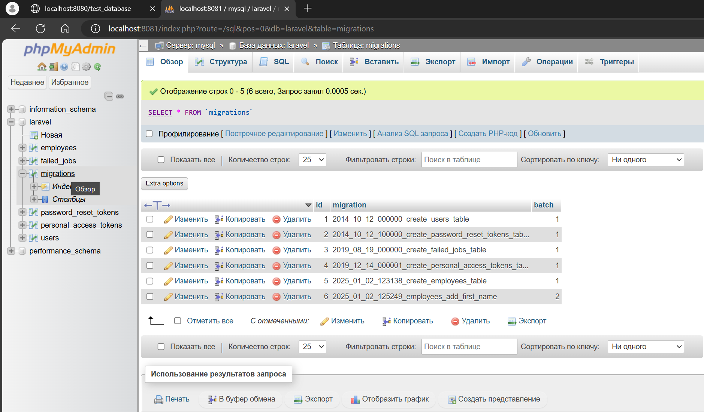

# Продвинутое программирование на PHP — Laravel

## Урок 1. Введение, установка и первичная настройка

## Урок 2. Контроллеры, экшены и роутинг

## Урок 3. Работа с базами данных. ORM-система Eloquent

## Урок 4. Работа с шаблонами. Шаблонизатор Blade

## Урок 12. Интеграция с внешними сервисами

